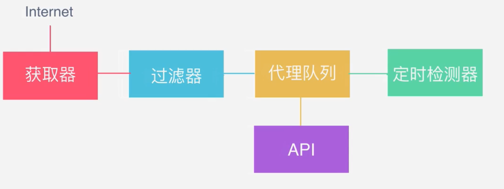

# 动态代理池

使用Redis+Flask维护动态代理池

## 简要说明

* 使用requests模块打开代理网站

* 使用fake_useragent随机生成User-Agent

* 使用aiohttp模块验证访问指定网站，用于验证代理是否有效

* 使用了两个进程，一个用于从网站上获取代理，一个用于验证缓存的代理是否有效

* 使用redis缓存代理地址，并封装常用数据库交互接口

* 使用flask框架向用户提供获取API接口，可以跨进程调用接口

* 代码参考自崔庆才的[网络爬虫][1]视屏教程以及[源码][2]

    [1]: https://edu.hellobi.com/course/156 'Python3爬虫三大案例实战分享'
    [2]: https://github.com/Germey/ProxyPool 'github'

## 改进计划

* 将该代理池中的同步请求代理网站改为异步请求

* 将从redis接口中的获取的代理不从redis中删除

---

## 笔记

* 代理池的要求

    1. 多站抓取，异步检测

        即从多个代理网站获取代理地址，并通过这些代理地址采用异步请求的方式访问指定网站,以检测代理是否有效

    2. 定时筛选，持续更新

        以固定时间重复从代理池中抽取一定数量的代理地址，检测这些地址是否有效，并删除其中无效地址

    3. 提供接口，易于提取

        通过提供接口的形式获取代理地址，简化获取代理地址的方式，从而方便得到代理地址

* 代理池的架构

    代理池的框架包括：
    1. 获取器：用于获取代理地址
    2. 过滤器：用于剔除代理地址中无效的地址
    3. 代理队列：将获取的地址存放在队列里
    4. 定时检测器：定时从代理队列中取出部分地址用以检测这些地址是否有效,并剔除无效地址
    5. API接口：通过提供接口的形式从代理队列里获取代理地址
    
    代理池架构图如下：
    

---

##  其他说明

此代理池在获取IP的时候使用了pop方法一次性使用，如果是想多次可用可以移步优化后的代理池：[https://github.com/Python3WebSpider/ProxyPool](https://github.com/Python3WebSpider/ProxyPool)，推荐使用。

## 安装

### 安装Python

至少Python3.5以上

### 安装Redis

安装好之后将Redis服务开启

### 配置代理池

```
cd proxypool
```

进入proxypool目录，修改settings.py文件

PASSWORD为Redis密码，如果为空，则设置为None

#### 安装依赖

```
pip3 install -r requirements.txt
```

#### 打开代理池和API

```
python3 run.py
```

## 获取代理

利用requests获取方法如下

```python
import requests

PROXY_POOL_URL = 'http://localhost:5000/get'

def get_proxy():
    try:
        response = requests.get(PROXY_POOL_URL)
        if response.status_code == 200:
            return response.text
    except ConnectionError:
        return None
```

## 各模块功能

* getter.py

  > 爬虫模块

  * class proxypool.getter.FreeProxyGetter

    > 爬虫类，用于抓取代理源网站的代理，用户可复写和补充抓取规则。

* schedule.py

  > 调度器模块

  * class proxypool.schedule.ValidityTester

    > 异步检测类，可以对给定的代理的可用性进行异步检测。

  * class proxypool.schedule.PoolAdder

    > 代理添加器，用来触发爬虫模块，对代理池内的代理进行补充，代理池代理数达到阈值时停止工作。

  * class proxypool.schedule.Schedule

    > 代理池启动类，运行RUN函数时，会创建两个进程，负责对代理池内容的增加和更新。

* db.py

  > Redis数据库连接模块

  * class proxypool.db.RedisClient

    > 数据库操作类，维持与Redis的连接和对数据库的增删查该，

* error.py

  > 异常模块

  * class proxypool.error.ResourceDepletionError

    > 资源枯竭异常，如果从所有抓取网站都抓不到可用的代理资源，
    >
    > 则抛出此异常。

  * class proxypool.error.PoolEmptyError

    > 代理池空异常，如果代理池长时间为空，则抛出此异常。

* api.py

  > API模块，启动一个Web服务器，使用Flask实现，对外提供代理的获取功能。

* utils.py

  > 工具箱

* setting.py

  > 设置

## 项目参考

[https://github.com/WiseDoge/ProxyPool](https://github.com/WiseDoge/ProxyPool)